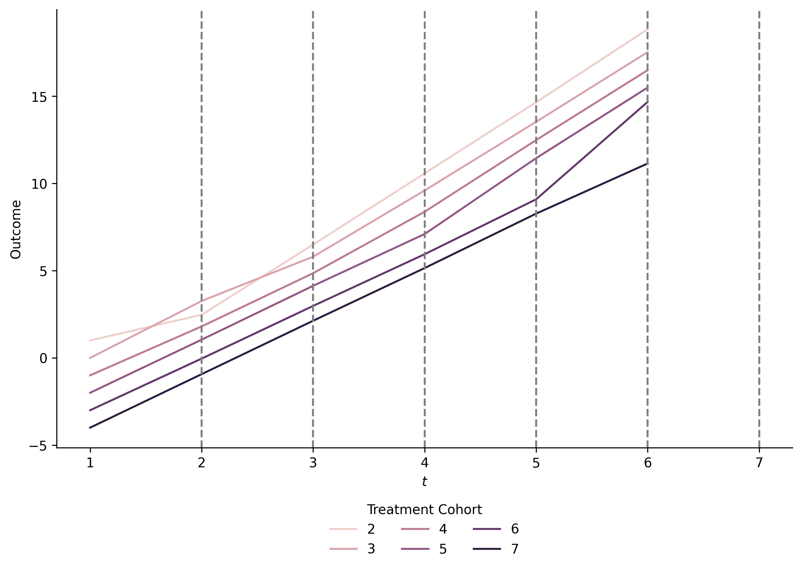

## did-stepwise: python implementation of the stepwise DID estimator

The `did_sw` package is a Python implementation of the stepwise DID
estimator of
[Harmon](https://web.econ.ku.dk/nharmon/docs/harmon2022difference.pdf).

See:

- [Installation](#installation)
- [Example](#example)
- [Some theory](#some-theory)
- Docs (to be added)

## Installation

``` python
uv pip install git+https://github.com/jsr-p/did-stepwise
```

## Example

The following example takes outset in the data simulated from
[this](scripts/stata/harmon_sim_data.do) script taken from
[Harmon’s](https://github.com/nikoharm/did_stepwise/blob/main/stepwise_examples.do)
repository.

``` python
import did_imp
import polars as pl
import seaborn as sns
import matplotlib.pyplot as plt
import plotnine as pn
```

``` python
import did_sw
from did_sw._testing import load_harmon_sim_data


data = load_harmon_sim_data()
transformed = data.transformed
df = data.raw

print(df.head())
```

    shape: (5, 12)
    ┌─────┬─────┬─────┬─────┬───┬───────────┬─────┬─────┬───────┐
    │ id  ┆ t   ┆ E   ┆ K   ┆ … ┆ Y         ┆ X1  ┆ X2  ┆ clust │
    │ --- ┆ --- ┆ --- ┆ --- ┆   ┆ ---       ┆ --- ┆ --- ┆ ---   │
    │ i64 ┆ i64 ┆ i64 ┆ i64 ┆   ┆ f64       ┆ f64 ┆ i64 ┆ i64   │
    ╞═════╪═════╪═════╪═════╪═══╪═══════════╪═════╪═════╪═══════╡
    │ 1   ┆ 1   ┆ 2   ┆ -1  ┆ … ┆ 1.0       ┆ 0.0 ┆ 50  ┆ 10    │
    │ 1   ┆ 2   ┆ 2   ┆ 0   ┆ … ┆ 2.8374085 ┆ 0.0 ┆ 50  ┆ 10    │
    │ 1   ┆ 3   ┆ 2   ┆ 1   ┆ … ┆ 6.2903514 ┆ 0.0 ┆ 50  ┆ 10    │
    │ 1   ┆ 4   ┆ 2   ┆ 2   ┆ … ┆ 11.157219 ┆ 0.0 ┆ 50  ┆ 10    │
    │ 1   ┆ 5   ┆ 2   ┆ 3   ┆ … ┆ 16.167133 ┆ 0.0 ┆ 50  ┆ 10    │
    └─────┴─────┴─────┴─────┴───┴───────────┴─────┴─────┴───────┘

``` python
gp = df.group_by("E", "t").agg(pl.col("Y").mean())

fig, ax = plt.subplots(figsize=(10, 6))
ax = sns.lineplot(
    data=gp.to_pandas(),
    x="t",
    y="Y",
    hue="E",
    ax=ax,
)
for E in sorted(df["E"].unique()):
    ax.axvline(E, color="grey", linestyle="--")
ax.set(ylabel="Outcome", xlabel="$t$")
ax.legend(
    title="Treatment Cohort",
    loc="upper center",
    bbox_to_anchor=(0.5, -0.1),
    ncol=3,
    frameon=False,
)
sns.despine()
_ = fig.savefig(
    did_sw.utils.proj_folder() / "figs/example_avg.png", dpi=300, bbox_inches="tight"
)
plt.close(fig)  # quarto
```



``` python
result = did_sw.estimate(
    df,
    outcome="Y",
    group="E",
    time="t",
    unit="id",
    fes="t",
    horizons="event",
)
print(result.estimates)
```

    shape: (5, 7)
    ┌──────┬──────────┬──────────┬───────────┬──────┬──────────┬──────────┐
    │ term ┆ estimate ┆ se       ┆ tstat     ┆ pval ┆ lower    ┆ upper    │
    │ ---  ┆ ---      ┆ ---      ┆ ---       ┆ ---  ┆ ---      ┆ ---      │
    │ str  ┆ f64      ┆ f64      ┆ f64       ┆ f64  ┆ f64      ┆ f64      │
    ╞══════╪══════════╪══════════╪═══════════╪══════╪══════════╪══════════╡
    │ 0    ┆ 0.501008 ┆ 0.053665 ┆ 9.335862  ┆ 0.0  ┆ 0.395825 ┆ 0.606191 │
    │ 1    ┆ 0.938361 ┆ 0.090709 ┆ 10.344759 ┆ 0.0  ┆ 0.760572 ┆ 1.11615  │
    │ 2    ┆ 1.44967  ┆ 0.128739 ┆ 11.260515 ┆ 0.0  ┆ 1.197341 ┆ 1.701999 │
    │ 3    ┆ 1.897607 ┆ 0.183167 ┆ 10.359964 ┆ 0.0  ┆ 1.538599 ┆ 2.256615 │
    │ 4    ┆ 2.756371 ┆ 0.265588 ┆ 10.378378 ┆ 0.0  ┆ 2.235819 ┆ 3.276923 │
    └──────┴──────────┴──────────┴───────────┴──────┴──────────┴──────────┘

Underneath the hood, the `did_sw` estimator uses the imputation
estimator of [BJS
estimator](https://academic.oup.com/restud/article/91/6/3253/7601390)
implemented in the `did_imp`
[package](https://github.com/jsr-p/did-imputation) on a transformed
dataset. Let’s compute event study estimates using the imputation
estimator directly on the non-transformed data.

``` python
# Compare with imputation estimator
result_imp = did_imp.estimate(
    df,
    outcome="Y",
    group="E",
    time="t",
    unit="id",
    # NOTE: observe how the fixed effects here are `id + t` compared to `t` in
    # the `did_sw` estimator; also, the outcome above is the non-differenced
    # `Y`
    fes="id + t",
    horizons="event",
)
print(result_imp.estimates)
```

    shape: (5, 7)
    ┌──────┬──────────┬──────────┬───────────┬────────────┬──────────┬──────────┐
    │ term ┆ estimate ┆ se       ┆ tstat     ┆ pval       ┆ lower    ┆ upper    │
    │ ---  ┆ ---      ┆ ---      ┆ ---       ┆ ---        ┆ ---      ┆ ---      │
    │ str  ┆ f64      ┆ f64      ┆ f64       ┆ f64        ┆ f64      ┆ f64      │
    ╞══════╪══════════╪══════════╪═══════════╪════════════╪══════════╪══════════╡
    │ 0    ┆ 0.512822 ┆ 0.066833 ┆ 7.673209  ┆ 1.6875e-14 ┆ 0.38183  ┆ 0.643814 │
    │ 1    ┆ 0.961453 ┆ 0.104562 ┆ 9.195015  ┆ 0.0        ┆ 0.75651  ┆ 1.166395 │
    │ 2    ┆ 1.472419 ┆ 0.141071 ┆ 10.437444 ┆ 0.0        ┆ 1.19592  ┆ 1.748918 │
    │ 3    ┆ 1.967783 ┆ 0.193971 ┆ 10.144728 ┆ 0.0        ┆ 1.587599 ┆ 2.347966 │
    │ 4    ┆ 2.749741 ┆ 0.277446 ┆ 9.910896  ┆ 0.0        ┆ 2.205946 ┆ 3.293535 │
    └──────┴──────────┴──────────┴───────────┴────────────┴──────────┴──────────┘

Plotting the estimates

``` python
def plot_eventstudy(
    res: pl.DataFrame,
    breaks: list[int],
):
    """Helper to plot event study estimates"""
    p = (
        pn.ggplot(res, pn.aes(x="rel_year", y="estimate", color="group"))
        + pn.geom_point(position=pn.position_dodge(width=(w := 0.3)))
        + pn.geom_errorbar(
            pn.aes(ymin="lower", ymax="upper"),
            width=0.1,
            position=pn.position_dodge(width=w),
        )
        + pn.theme_classic()
        + pn.labs(
            x="Relative Time",
            y="Estimate",
            color="",
        )
        + pn.scale_x_continuous(breaks=breaks)
        + pn.geom_hline(yintercept=0, color="black", size=0.5, linetype="dotted")
        + pn.geom_vline(xintercept=0, color="black", size=0.5, linetype="dotted")
        + pn.theme(
            legend_position="bottom",
            axis_title=pn.element_text(size=14),
            axis_text=pn.element_text(size=12),
            legend_text=pn.element_text(size=12),
            legend_title=pn.element_text(size=13),
        )
    )
    return p


estimates = result.estimates.filter(pl.col("term").ne("average")).select(
    pl.col("term").cast(pl.Int8).alias("rel_year"),
    "estimate",
    "se",
    "lower",
    "upper",
    pl.lit("SWDD").alias("group"),
)
estimates_imp = result_imp.estimates.select(
    pl.col("term").cast(pl.Int8).alias("rel_year"),
    "estimate",
    "se",
    "lower",
    "upper",
    pl.lit("DID Imputation").alias("group"),
)
results = pl.concat([estimates, estimates_imp], how="vertical_relaxed").with_columns(
    pl.col("rel_year").cast(pl.Int8)
)

# Plot the estimates
p = plot_eventstudy(results, breaks=list(range(5)))
p.save(
    did_sw.utils.proj_folder() / "figs/example_estimates.png",
    width=10,
    height=6,
    transparent=False,
    verbose=False,
    dpi=300,
)
```


### With covariates and clustered standard errors

``` python
# Clustered

r = did_sw.estimate(
    df,
    outcome="Y",
    group="E",
    time="t",
    unit="id",
    cluster_var="clust",
    fes="t",
    horizons="event",
)
print(r.estimates)

# Categorical
r = did_sw.estimate(
    df,
    outcome="Y",
    group="E",
    time="t",
    cluster_var="id",
    unit="id",
    covariates=["C(X2) : C(t)"],
    fes="t",
    horizons="event",
)
print(r.estimates)


# Continuous
r = did_sw.estimate(
    df,
    outcome="Y",
    group="E",
    time="t",
    cluster_var="id",
    unit="id",
    covariates=["-1 + X1 : C(t)"],
    fes="t",
    horizons="event",
)
print(r.estimates)
```

    shape: (5, 7)
    ┌──────┬──────────┬──────────┬───────────┬──────┬──────────┬──────────┐
    │ term ┆ estimate ┆ se       ┆ tstat     ┆ pval ┆ lower    ┆ upper    │
    │ ---  ┆ ---      ┆ ---      ┆ ---       ┆ ---  ┆ ---      ┆ ---      │
    │ str  ┆ f64      ┆ f64      ┆ f64       ┆ f64  ┆ f64      ┆ f64      │
    ╞══════╪══════════╪══════════╪═══════════╪══════╪══════════╪══════════╡
    │ 0    ┆ 0.501008 ┆ 0.059125 ┆ 8.473706  ┆ 0.0  ┆ 0.385123 ┆ 0.616893 │
    │ 1    ┆ 0.938361 ┆ 0.080797 ┆ 11.613822 ┆ 0.0  ┆ 0.779999 ┆ 1.096723 │
    │ 2    ┆ 1.44967  ┆ 0.11477  ┆ 12.631044 ┆ 0.0  ┆ 1.22472  ┆ 1.67462  │
    │ 3    ┆ 1.897607 ┆ 0.158204 ┆ 11.994648 ┆ 0.0  ┆ 1.587526 ┆ 2.207688 │
    │ 4    ┆ 2.756371 ┆ 0.258764 ┆ 10.652067 ┆ 0.0  ┆ 2.249194 ┆ 3.263548 │
    └──────┴──────────┴──────────┴───────────┴──────┴──────────┴──────────┘

    /home/jsr-p/projects/stats-packages/did-stepwise/.venv/lib/python3.12/site-packages/pyfixest/estimation/feols_.py:2628: UserWarning: 
                4 variables dropped due to multicollinearity.
                The following variables are dropped: ['C(t)[T.3]', 'C(t)[T.4]', 'C(t)[T.5]', 'C(t)[T.6]'].
                

    shape: (5, 7)
    ┌──────┬──────────┬──────────┬───────────┬──────┬──────────┬──────────┐
    │ term ┆ estimate ┆ se       ┆ tstat     ┆ pval ┆ lower    ┆ upper    │
    │ ---  ┆ ---      ┆ ---      ┆ ---       ┆ ---  ┆ ---      ┆ ---      │
    │ str  ┆ f64      ┆ f64      ┆ f64       ┆ f64  ┆ f64      ┆ f64      │
    ╞══════╪══════════╪══════════╪═══════════╪══════╪══════════╪══════════╡
    │ 0    ┆ 0.505401 ┆ 0.057061 ┆ 8.857207  ┆ 0.0  ┆ 0.393562 ┆ 0.617241 │
    │ 1    ┆ 0.937251 ┆ 0.094178 ┆ 9.951911  ┆ 0.0  ┆ 0.752663 ┆ 1.12184  │
    │ 2    ┆ 1.446173 ┆ 0.130892 ┆ 11.048591 ┆ 0.0  ┆ 1.189625 ┆ 1.702722 │
    │ 3    ┆ 1.873075 ┆ 0.187628 ┆ 9.982922  ┆ 0.0  ┆ 1.505324 ┆ 2.240826 │
    │ 4    ┆ 2.773142 ┆ 0.289131 ┆ 9.591315  ┆ 0.0  ┆ 2.206446 ┆ 3.339837 │
    └──────┴──────────┴──────────┴───────────┴──────┴──────────┴──────────┘
    shape: (5, 7)
    ┌──────┬──────────┬──────────┬───────────┬──────┬──────────┬──────────┐
    │ term ┆ estimate ┆ se       ┆ tstat     ┆ pval ┆ lower    ┆ upper    │
    │ ---  ┆ ---      ┆ ---      ┆ ---       ┆ ---  ┆ ---      ┆ ---      │
    │ str  ┆ f64      ┆ f64      ┆ f64       ┆ f64  ┆ f64      ┆ f64      │
    ╞══════╪══════════╪══════════╪═══════════╪══════╪══════════╪══════════╡
    │ 0    ┆ 0.492878 ┆ 0.054642 ┆ 9.020127  ┆ 0.0  ┆ 0.385779 ┆ 0.599976 │
    │ 1    ┆ 0.934418 ┆ 0.091581 ┆ 10.203217 ┆ 0.0  ┆ 0.75492  ┆ 1.113916 │
    │ 2    ┆ 1.43822  ┆ 0.129478 ┆ 11.107868 ┆ 0.0  ┆ 1.184444 ┆ 1.691996 │
    │ 3    ┆ 1.886186 ┆ 0.184845 ┆ 10.20414  ┆ 0.0  ┆ 1.52389  ┆ 2.248483 │
    │ 4    ┆ 2.77223  ┆ 0.276423 ┆ 10.028957 ┆ 0.0  ┆ 2.230442 ┆ 3.314018 │
    └──────┴──────────┴──────────┴───────────┴──────┴──────────┴──────────┘

------------------------------------------------------------------------

## Some theory

In the following:

- $`Y_{i, t}`$ is outcome for unit $`i`$ in period $`t`$.

- $`E_{i}`$ treatment date for unit $`i`$

- $`K_{i, t} = t - E_{i}`$ relative treatment time for unit $`i`$ in
  period $`t`$

- $`D_{i, t} = \mathbf{1}\{K_{i, t} \geq 0\}`$ treatment indicator for
  unit $`i`$ in period $`t`$

### SGDD vs SWDD estimators

Harmon characterizes two groups of DID estimators:

- **Subgroup Difference-in-Differences** (SGDD)

- **Stepwise Difference-in-Differences** (SWDD)

SGDD estimators have the form:

``` math
\begin{aligned}
    \hat{\gamma}^{SGDD}_{i, h}
    = (Y_{i, E_{i} + h} - Y_{i, E_{i} - 1})
    - \frac{1}{\mathcal{N}}
    \sum_{j: D_{j, E_{i + h} = 0}}
    (Y_{j, E_{i} + h} - Y_{j, E_{i} - 1}).
\end{aligned}
```

where we in the right part sum over all those $`j`$ who are not treated
by $`E_{i
            + h}`$ (i.e. $`D_{j, E_{i + h} = 0}`$).

OOH, SWDD estimators have the form:

``` math
\begin{aligned}
    \hat{\gamma}^{SWDD}_{i, h}
    =
    \sum_{k = 0}^{h}
    \left[
        (Y_{i, E_{i} + k} - Y_{i, E_{i} + k - 1})
        -
        \frac{1}{\mathcal{N}}
        \sum_{j: D_{j, E_{i + k} = 0}}
        (Y_{j, E_{i} + k} - Y_{j, E_{i} + k - 1})
        \right]
\end{aligned}
```

where $`\mathcal{N}^{-1}`$ is a normalization factor for the inner sum
i.e. it differs for each $`k`$. Note that the first term telescopes such
that

``` math
\begin{aligned}
    \sum_{k = 0}^{h}
    (Y_{i, E_{i} + k} - Y_{i, E_{i} + k - 1})
     & =
    (Y_{i, E_{i}} - Y_{i, E_{i}- 1})
    +
    (Y_{i, E_{i} + 1} - Y_{i, E_{i}})
    +
    \cdots
    +
    (Y_{i, E_{i} + h} - Y_{i, E_{i} + h - 1}) \\
     & =
    (Y_{i, E_{i} + h} - Y_{i, E_{i} - 1})
\end{aligned}
```

and thus

``` math
\begin{aligned}
    \hat{\gamma}^{SWDD}_{i, h}
    =
    (Y_{i, E_{i} + h} - Y_{i, E_{i} - 1})
    -
    \sum_{k = 0}^{h}
    \left[
        \frac{1}{\mathcal{N}}
        \sum_{j: D_{j, E_{i + k} = 0}}
        (Y_{j, E_{i} + k} - Y_{j, E_{i} + k - 1})
        \right]
\end{aligned}
```

Comparing $`\hat{\gamma}^{SWDD}_{i, h}`$ to
$`\hat{\gamma}^{SGDD}_{i, h}`$ we see that the SWDD estimator
potentially includes more information than the SGDD estimator, while it
includes the stepwise differences for the non-treated units; the
stepwise comparisons use the time tuples $`\{(E_{i} + k, E_{i} + k -
    1)\}_{k=0}^{h}`$. Because of the extra comparisons in the control
group, the SWDD estimator potentially has a lower variance (is more
efficient) than the SGDD estimator for longer horizons; see the paper
(in particular the online appendix) for details.

------------------------------------------------------------------------

### Examples from paper

- [Numerical results](scripts/harmon_simexperiment.py)
  - [Output](output/harmon_simexperiment.txt)
- [Illustrative example of SWDD efficiency gains over
  SGDD](scripts/harmon_ex.py)
  - [Output](output/harmon_ex.txt)

### Imputation estimator

It turns out that the SWDD estimator of Harmon can be written as an
imputation estimator ala.
[BJS](https://academic.oup.com/restud/article/91/6/3253/7601390);
concretely, we estimate the $\hat{\gamma}^{SWDD}_{i, h}$’s using the BJS
imputation estimator on a transformed dataset. Hence, this package
depends on the `did_imp`
[package](https://github.com/jsr-p/did-imputation). See the
[paper](https://web.econ.ku.dk/nharmon/docs/harmon2022difference.pdf)
for more details.

## Development

``` bash
git clone git@github.com:jsr-p/did-stepwise.git
cd tabx
uv venv
uv sync --all-extras
```

### Testing

- 🚧🔨⏳Work in progress! 🚧🔨⏳
- Don’t open the `tests` folder yet; 🍝 inside

### Docs

- 🚧🔨⏳Work in progress! 🚧🔨⏳

## References

- [Harmon
  paper](https://web.econ.ku.dk/nharmon/docs/harmon2022difference.pdf)

Code inspiration taken from:

- <https://github.com/nikoharm/did_stepwise>
